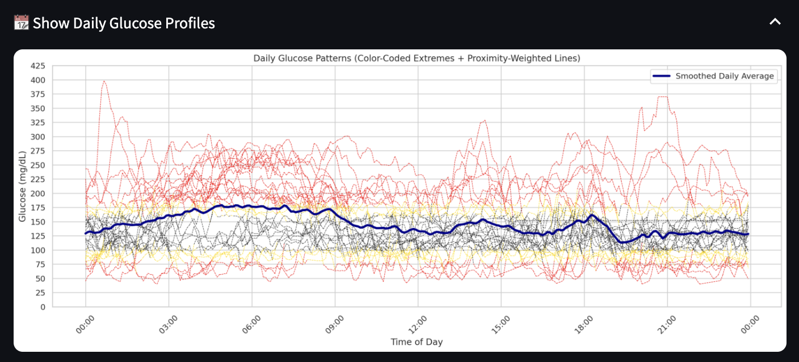
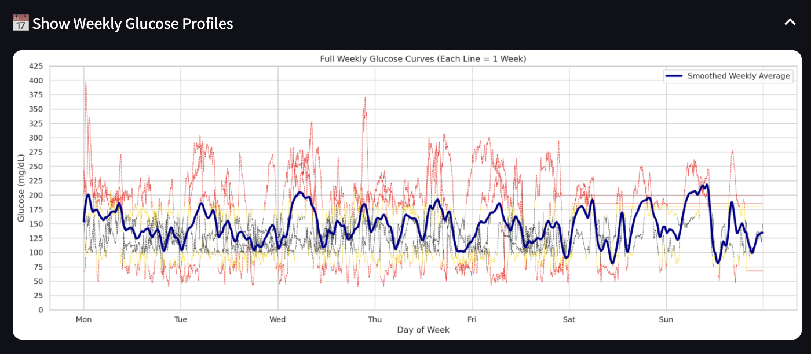
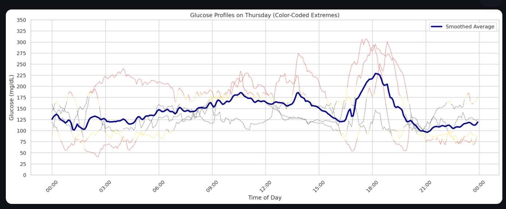
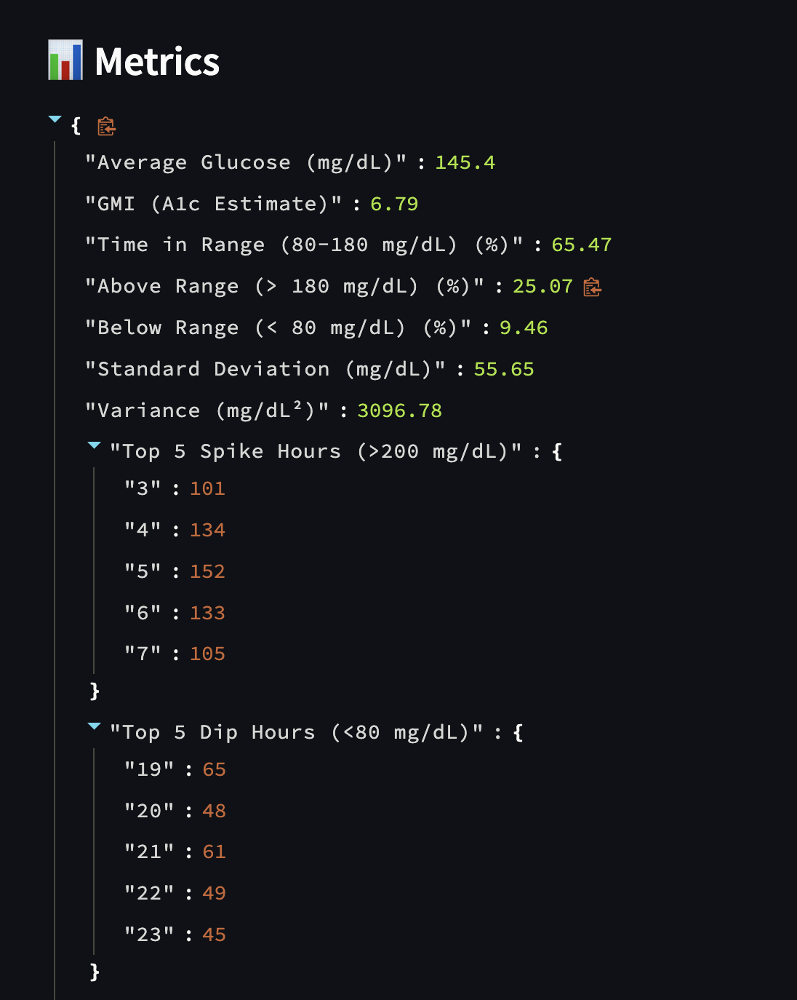

# CGM Insights Dashboard

A Streamlit web app that transforms raw Continuous Glucose Monitor (CGM) data into actionable insights.  
Upload your CGM CSV file to visualize time-in-range percentages, glucose trends, spike patterns, and weekly behavior.

**🔗 Live App:** [cgm-insights.streamlit.app](https://cgm-insights.streamlit.app/)

> Built for people with diabetes and healthcare analysts who want more than what Clarity or LibreView provide.

---

## 🚀 Features

- 📈 Time-series glucose visualization  
- 🎯 Customizable target range sliders  
- 📅 Day-by-day and weekday-based analysis  
- 📊 Spike/dip frequency and magnitude detection  
- 🧠 Estimated meal times based on glucose acceleration  
- 📉 Time in range (TIR), GMI, SDV, and more

---

## 🧪 Sample Output

Here are a few example visualizations:

| Daily Avg. | Weekly Avg. | Day of Week Avg. | TIR & Analytics |
|--------------------|---------------------|---------------------------|-----------------|
|  |  |  |  |

---

## 🛠 Getting Started Locally/ Modifications

Feel free to modify the Python file for your own benefit. This is meant to be a tool!

To run locally:

```bash
pip install -r requirements.txt
streamlit run app.py
